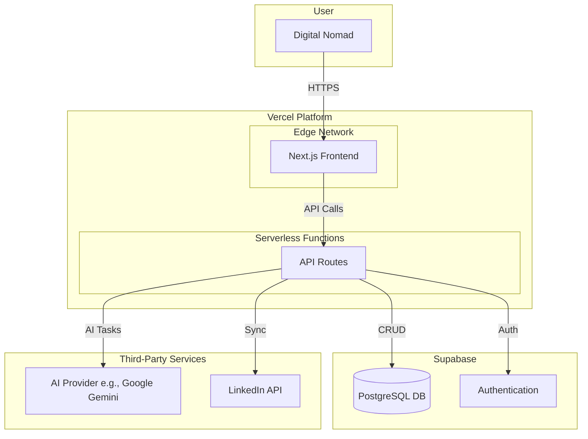

## 🏗️ Fullstack Architecture Document


# CV Match Fullstack Architecture Document

## Introduction

This document outlines the complete fullstack architecture for CV Match, including backend systems, frontend implementation, and their integration. It serves as the single source of truth for AI-driven development, ensuring consistency across the entire technology stack. This unified approach combines what would traditionally be separate backend and frontend architecture documents, streamlining the development process for modern fullstack applications where these concerns are increasingly intertwined.

### Starter Template or Existing Project

N/A - This architecture is based on a clean, standard Next.js installation, as no specific starter template was selected.

### Change Log

| Date | Version | Description | Author |
| :--- | :--- | :--- | :--- |
| 2025-10-07 | 1.0 | Initial architecture draft | Winston, Architect |

## High Level Architecture

### Technical Summary

The architecture for CV Match will be a **serverless, fullstack application** built on a **Next.js monorepo**. The frontend will be a responsive React application, while the backend logic will be handled by serverless functions, all deployed on Vercel. Key components include a Supabase instance for the PostgreSQL database and authentication, an AI engine for processing, and a unified API layer. This Jamstack-style architecture prioritizes rapid development, low operational overhead, and scalability, directly supporting the PRD's goals for a cost-effective MVP.

### Platform and Infrastructure Choice

  * **Platform:** **Vercel** for hosting and serverless functions, and **Supabase** as the backend-as-a-service.
  * **Key Services:**
      * **Vercel:** Next.js Hosting, Serverless Functions, Global CDN.
      * **Supabase:** PostgreSQL Database, Authentication.
      * **AI Provider (e.g., Google Gemini, OpenAI):** For LLM-based CV generation.
      * **Vector DB (e.g., Supabase pgvector):** For vector embeddings and semantic search.
  * **Deployment Host and Regions:** Vercel's global edge network. The database region will be `ap-southeast-1` (Singapore) to best serve the initial target market in Da Nang.

### Repository Structure

  * **Structure:** **Monorepo**.
  * **Monorepo Tool:** **Turborepo** is recommended for its high-performance build system and seamless integration with Vercel.
  * **Package Organization:** The monorepo will contain an `apps` directory for the main `web` application and a `packages` directory for shared code like `ui` components and `config` files.

### High Level Architecture Diagram



### Architectural Patterns

  * **Jamstack Architecture:** The frontend will be a fast, pre-renderable application served from a global CDN, interacting with backend services via APIs. This enhances performance and security.
  * **Serverless Functions:** All backend logic will reside in serverless functions (Next.js API Routes), which aligns with our goal for a low-cost, auto-scaling infrastructure.
  * **Backend-as-a-Service (BaaS):** We will leverage Supabase to handle our database and user authentication, significantly reducing development time and complexity.
  * **Repository Pattern:** We will use the repository pattern to abstract our data access logic from our business logic, making the application more modular and easier to test.

## Tech Stack

### Technology Stack Table

| Category | Technology | Version | Purpose | Rationale |
| :--- | :--- | :--- | :--- | :--- |
| **Frontend Language** | TypeScript | `~5.x` | Language for frontend development | Provides type safety, improving code quality and maintainability. |
| **Frontend Framework**| Next.js | `~14.x` | React framework for the web app | Enables rapid development, server-side rendering, and serverless functions. |
| **UI Library** | shadcn/ui | `Latest` | Collection of accessible UI components | Accelerates UI development with pre-built, customizable, and accessible components. |
| **State Management** | Zustand | `~4.x` | Lightweight state management | Simple, unopinionated state management for React if built-in hooks are insufficient. |
| **Backend Language** | TypeScript | `~5.x` | Language for API development | Ensures consistency and type safety across the full stack. |
| **Backend Framework**| Next.js API Routes| `~14.x` | Framework for serverless functions | Unifies the codebase, allowing frontend and backend code in one project. |
| **Database** | PostgreSQL | `16.x` | Primary relational database | Powerful, reliable, and expertly managed by Supabase. |
| **Authentication** | Supabase Auth | `Latest` | User management and authentication | Provides a secure, pre-built solution for auth, including OAuth with LinkedIn. |
| **Vector Database** | Supabase `pgvector`| `Latest` | Semantic search for AI matching | Integrates vector search directly into our main PostgreSQL database. |
| **AI Provider** | Google Gemini, OpenAI | `Latest` | Core AI text and embedding generation | Allows flexibility to choose the most cost-effective and performant model. |
| **Frontend Testing** | Vitest & RTL | `Latest` | Unit and integration testing | A fast, modern testing framework that works seamlessly with React Testing Library. |
| **Backend Testing** | Vitest | `Latest` | API and business logic testing | Provides a consistent testing framework across the monorepo. |
| **E2E Testing** | Playwright | `Latest` | End-to-end browser testing | Robust and reliable for testing complete user flows across different browsers. |
| **Monorepo Tool** | Turborepo | `Latest` | High-performance build system | Manages the monorepo, optimizing build times and development workflows. |
| **Deployment** | Vercel | `Latest` | Hosting and CI/CD platform | Offers zero-configuration deployment for Next.js and handles our CI/CD pipeline. |
| **Monitoring** | Vercel Analytics | `Latest` | Performance and usage monitoring | Built-in, privacy-friendly analytics to track Core Web Vitals and traffic. |
| **CSS Framework** | Tailwind CSS | `~3.x` | Utility-first CSS framework | Enables rapid and consistent styling directly in the markup. |

## Data Models

### Profile

  * **Purpose:** To store public profile information and application-specific settings for each authenticated user, linked to their core authentication record in Supabase Auth.
  * **TypeScript Interface**

<!-- end list -->

```typescript
export interface Profile {
  id: string; // Corresponds to Supabase user ID
  full_name: string | null;
  avatar_url: string | null;
  profession: string | null;
}
```

  * **Relationships:** One-to-One with `auth.users`, One-to-Many with `Accounts`, `Components`, and `CVs`.

### Account

  * **Purpose:** To store the connection details for each third-party platform (like LinkedIn or GitHub) that a user links to their profile.
  * **TypeScript Interface**

<!-- end list -->

```typescript
// This client-safe interface omits sensitive tokens.
export interface Account {
  id: string;
  provider: 'linkedin' | 'github' | 'behance';
  provider_account_id: string;
  last_synced_at: string | null;
}
```

  * **Relationships:** Many-to-One with `Profile`.

### Component

  * **Purpose:** To store a single, atomic piece of a user's professional history (e.g., one job, one project, one skill).
  * **TypeScript Interface**

<!-- end list -->

```typescript
export interface Component {
  id: string;
  type: 'experience' | 'project' | 'education' | 'skill';
  title: string;
  organization: string | null;
  start_date: string | null;
  end_date: string | null;
  description: string | null;
  highlights: string[];
}
```

  * **Relationships:** Many-to-One with `Profile` and `Account`.

### CV

  * **Purpose:** To store a specific curriculum vitae created by a user, representing a curated and ordered assembly of components.
  * **TypeScript Interface**

<!-- end list -->

```typescript
interface CvSection {
  section_title: string;
  component_ids: string[]; // An ordered array of Component IDs
}

export interface CV {
  id: string;
  user_id: string;
  title: string;
  job_description: string;
  match_score: number;
  content: CvSection[];
}
```

  * **Relationships:** Many-to-One with `Profile`. The `content` field establishes a Many-to-Many relationship with `Components`.

## API Specification

Authentication: All endpoints require an authenticated user session, unless otherwise noted.

| Method | Endpoint | Description |
| :--- | :--- | :--- |
| `GET` | `/api/auth/signin/linkedin` | Initiates the LinkedIn OAuth sign-in flow. |
| `GET` | `/api/me` | Gets the current user's profile details. |
| `GET` | `/api/components` | Lists all of the user's professional components. |
| `POST` | `/api/components` | Creates a new manual component. |
| `POST` | `/api/cvs/generate` | **(AI)** Generates a new CV draft from a Job Description. |
| `GET` | `/api/cvs/{id}/export` | Generates and returns the CV as a PDF file. |
| `POST` | `/api/ai/rephrase` | **(AI)** Rephrases a given piece of text. |

## Components

(This section defines the logical software components like the Frontend Application, API Layer, MCP Service, and AI Engine, along with an interaction diagram.)

## External APIs

(This section details the integration with the LinkedIn API and a provider-agnostic AI API, e.g., Google Gemini or OpenAI.)

## Core Workflows

(This section includes a sequence diagram for the critical "CV Generation Workflow," showing how all the software components interact.)

## Database Schema

(This section provides the complete SQL DDL to create the `profiles`, `accounts`, `components`, and `cvs` tables in PostgreSQL, including indexes and notes on Row Level Security.)

## Frontend Architecture

### Component Architecture

  * **Organization:** A functional grouping within `src/components/` (`ui/`, `features/`, `layout/`).
  * **Template:** A standard template for React components using TypeScript, `React.forwardRef`, and a `cn` utility for Tailwind CSS.

### State Management Architecture

  * **Structure:** Domain-specific stores in `src/stores/` (e.g., `user-store.ts`, `cv-editor-store.ts`).
  * **Patterns:** Using Zustand for lightweight global state, with a clear template for creating new stores.

### Routing Architecture

  * **Organization:** Using the Next.js App Router with file-system-based routing and Route Groups for authenticated sections.
  * **Protection:** Using Next.js Middleware to secure protected routes by checking for a valid Supabase session.

### Frontend Services Layer

  * **API Client:** A centralized `apiClient` that wraps `fetch` to automatically attach the Supabase authentication token to all requests.
  * **Services:** Dedicated service files (e.g., `cv-service.ts`) that encapsulate all API communication logic, to be called from UI components.

\</details\>