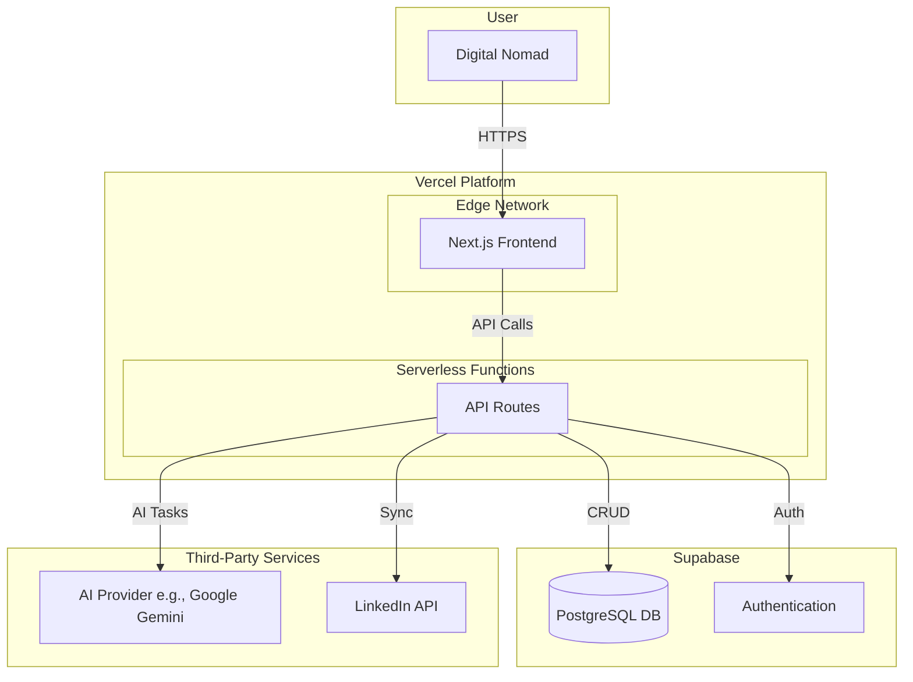

# CV Match Architecture Overview

## Introduction

This document outlines the complete fullstack architecture for CV Match, including backend systems, frontend implementation, and their integration. It serves as the single source of truth for AI-driven development, ensuring consistency across the entire technology stack. This unified approach combines what would traditionally be separate backend and frontend architecture documents, streamlining the development process for modern fullstack applications where these concerns are increasingly intertwined.

### Starter Template or Existing Project

N/A - This architecture is based on a clean, standard Next.js installation, as no specific starter template was selected.

### Change Log

| Date | Version | Description | Author |
| :--- | :--- | :--- | :--- |
| 2025-10-07 | 1.0 | Initial architecture draft | Winston, Architect |

## High Level Architecture

### Technical Summary

The architecture for CV Match will be a **serverless, fullstack application** built on a **Next.js monorepo**. The frontend will be a responsive React application, while the backend logic will be handled by serverless functions, all deployed on Vercel. Key components include a Supabase instance for the PostgreSQL database and authentication, an AI engine for processing, and a unified API layer. This Jamstack-style architecture prioritizes rapid development, low operational overhead, and scalability, directly supporting the PRD's goals for a cost-effective MVP.

### Platform and Infrastructure Choice

  * **Platform:** **Vercel** for hosting and serverless functions, and **Supabase** as the backend-as-a-service.
  * **Key Services:**
      * **Vercel:** Next.js Hosting, Serverless Functions, Global CDN.
      * **Supabase:** PostgreSQL Database, Authentication.
      * **AI Provider (e.g., Google Gemini, OpenAI):** For LLM-based CV generation.
      * **Vector DB (e.g., Supabase pgvector):** For vector embeddings and semantic search.
  * **Deployment Host and Regions:** Vercel's global edge network. The database region will be `ap-southeast-1` (Singapore) to best serve the initial target market in Da Nang.

### Repository Structure

  * **Structure:** **Monorepo**.
  * **Monorepo Tool:** **Turborepo** is recommended for its high-performance build system and seamless integration with Vercel.
  * **Package Organization:** The monorepo will contain an `apps` directory for the main `web` application and a `packages` directory for shared code like `ui` components and `config` files.

### High Level Architecture Diagram

### Architectural Patterns

  * **Jamstack Architecture:** The frontend will be a fast, pre-renderable application served from a global CDN, interacting with backend services via APIs. This enhances performance and security.
  * **Serverless Functions:** All backend logic will reside in serverless functions (Next.js API Routes), which aligns with our goal for a low-cost, auto-scaling infrastructure.
  * **Backend-as-a-Service (BaaS):** We will leverage Supabase to handle our database and user authentication, significantly reducing development time and complexity.
  * **Repository Pattern:** We will use the repository pattern to abstract our data access logic from our business logic, making the application more modular and easier to test.